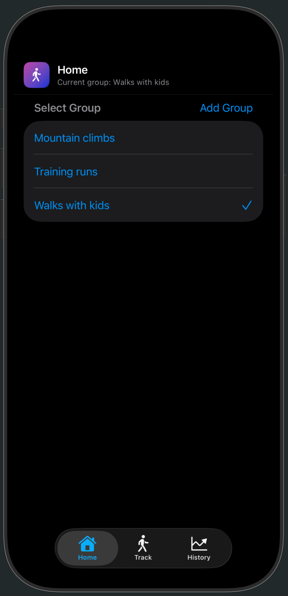
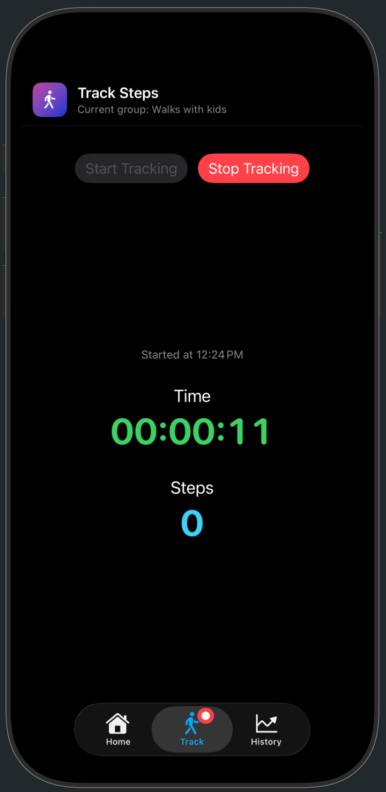
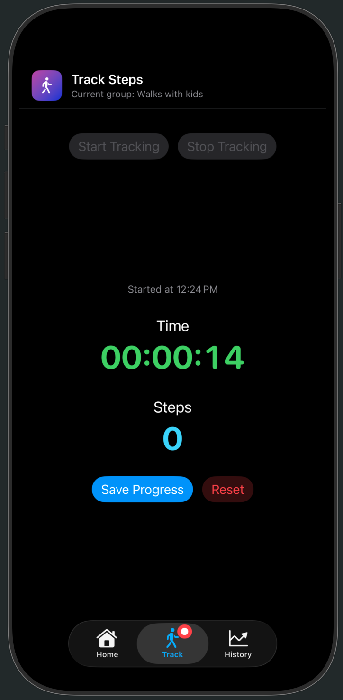
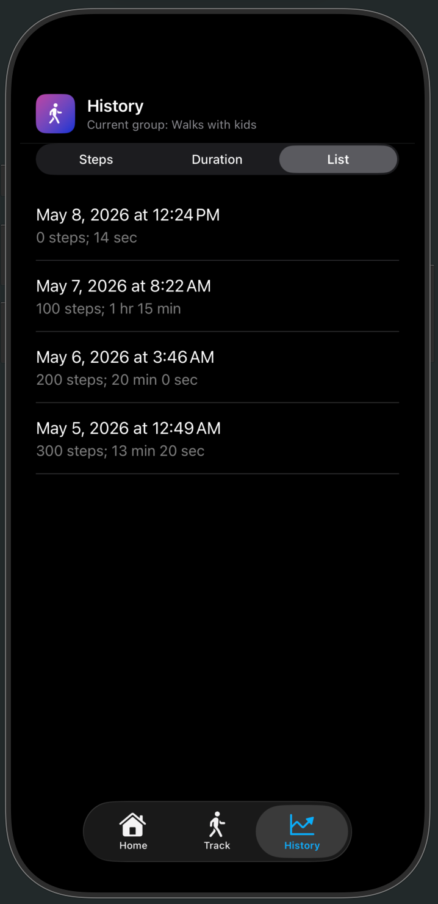
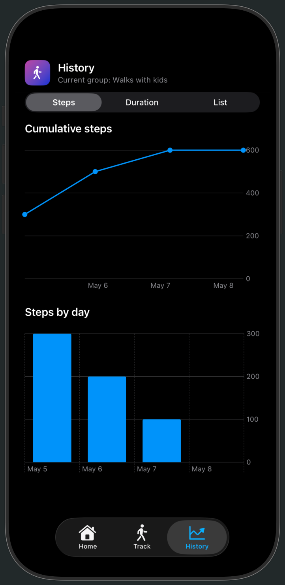

# SimpleStepTracker

SimpleStepTracker is an iOS app that lets you log and review your walks across named groups — great for separating different walking contexts like commutes, hikes, or exercise. Track live step counts and elapsed time during a session, then browse cumulative and daily charts of your history. Built with SwiftUI and SwiftData for a simple fully local, no-account experience.

## App UI Overview

The app has three tabs:
- **Home** — Manage up to 5 named walk groups (e.g. "Morning Walks", "Hikes"). Groups can be created, renamed, and deleted. A default "My Walks" group is created on first launch.
- **Track** — Start a walk session, stop when done, then save or reset. Shows a live step count and elapsed time during an active session.
- **History** — View saved sessions for the active group with three display modes:
  - **Steps** — Cumulative step line chart + daily steps bar chart
  - **Duration** — Cumulative duration line chart + daily duration bar chart
  - **List** — Scrollable list of all sessions with date, steps, and duration

## Screenshots

<table>
  <tr>
    <td align="center"><strong>Home</strong></td>
    <td align="center"><strong>Track (In Progress)</strong></td>
    <td align="center"><strong>Track (Save or Reset)</strong></td>
  </tr>
  <tr>
    <td></td>
    <td></td>
    <td></td>
  </tr>
  <tr>
    <td align="center"><strong>History (List)</strong></td>
    <td align="center"><strong>History (Charts)</strong></td>
    <td></td>
  </tr>
  <tr>
    <td></td>
    <td></td>
    <td></td>
  </tr>
</table>

## Architecture

| File | Responsibility |
|------|----------------|
| `SimpleStepTrackerApp.swift` | App entry point, SwiftData model container setup |
| `ContentView.swift` | Root `TabView` with Home / Track / History tabs |
| `HomeView.swift` | Management of walk groups (create, read, update, delete) |
| `TrackingView.swift` | Live session tracking, CoreMotion pedometer updates, save/reset flow |
| `HistoryView.swift` | Charts and session list for a selected group |
| `DataModels.swift` | SwiftData models (`WalkGroup`, `WalkSession`) and history aggregation structs |
| `Formatters.swift` | Shared time interval formatting utilities |

## Requirements

- iOS 17+
- Motion & Fitness permission for live pedometer updates
- Xcode 16+